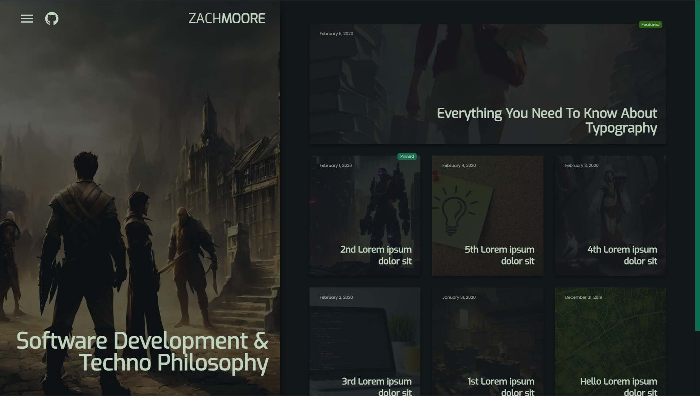
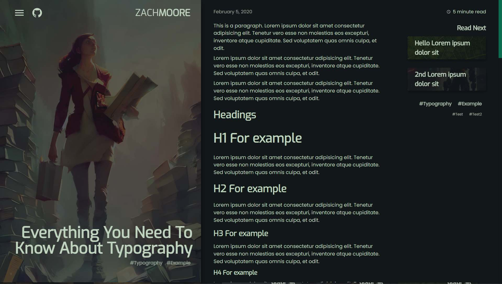

# Column Style Image Blog Template for Astro
Originally forked from [Astro templates demo](https://creativedesignsguru.com/demo/astro-boilerplate/).

Protoype project when Astro was brand new. Ultimately, I decided to go with a different approach for my blog. I'm leaving this here for reference. Feel free to use it any way you wish.

Images produced with Stable Diffusion




---

## Features

A complete Blog feature:

- 🎈 Syntax Highlighting
- 🤖 SEO friendly with sitemap.xml and robots.txt
- ⚙️ RSS feed
- 📖 Pagination
- 🌈 Include a dark blog theme
- ⬇️ Markdown
- 📦 Image lazy loading
- 💎 Responsive design

Developer experience first:

- 🔥 Astro
- 🎨 Tailwind CSS with aspect ratio and typography plugin
- 🎉 TypeScript
- ✏️ ESLint compatible with .astro files
- 🛠 Prettier compatible with .astro files
- 🦊 Husky
- 🚫 lint-staged
- 🚨 Commitlint
- 🔧 One-click deploy on Netlify (or, manual if you prefer)

ESLint with:

- Airbnb styled guide
- TypeScript compatible
- Astro compatible
- Automatically remove unused imports
- Import sorting
- Tailwind CSS plugin

### Getting started

Run the following command on your local environment:

``` bash
git clone --depth=1 https://github.com/zachacious/astro-column-blog-template.git
cd my-project-name
npm install
```

Then, you can run locally in development mode with live reload:

``` bash
npm run dev
```

Open [http://localhost:3000](http://localhost:3000) with your favorite browser
to see your project.

### Deploy to production (manual)

You can create an optimized production build with:

```shell
npm run build-prod
```

Now, your blog is ready to be deployed. All generated files are located at
`dist` folder, which you can deploy the folder to any hosting service you
prefer.

### Deploy to Netlify

Clone this repository on own GitHub account and deploy to Netlify:

[](https://app.netlify.com/start/deploy?repository=https://github.com/ixartz/Astro-boilerplate)

## 🧞 Commands

All commands are run from the root of the project, from a terminal:

| Command           | Action                                       |
|:----------------  |:-------------------------------------------- |
| `npm install`     | Installs dependencies                        |
| `npm run dev`     | Starts local dev server at `localhost:3000`  |
| `npm run build`   | Build your production site to `./dist/`      |
| `npm run preview` | Preview your build locally, before deploying |
| `npm run clean`   | Remove `./dist` folder                       |
| `npm run lint`    | Run ESLint and report styling error          |
